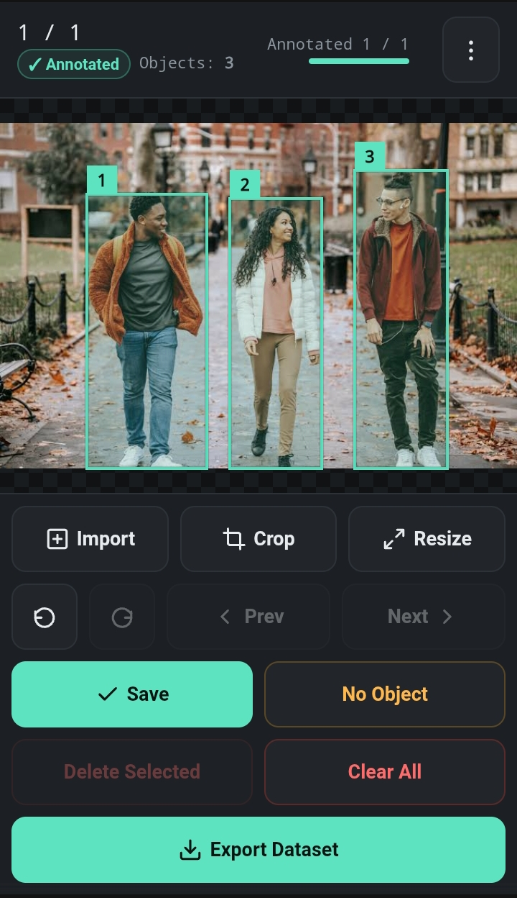

# TapBox

A self-contained, browser-based image annotation and dataset-preparation tool for creating object-detection datasets — designed especially for touchscreens and Android phones.

## Overview

TapBox is a single-page web application for importing images, creating and editing bounding-box annotations, preparing images, reviewing annotations, saving project metadata, and exporting datasets.

It is designed with a **mobile-first interface** using large touch-friendly controls and Pointer Events for touch and mouse interaction.

TapBox is implemented as a single `index.html` file containing the application's HTML, CSS, and JavaScript. The application processes imported images in the browser.

The current annotation system uses a single object class:

```text
class_id: 0
class_name: object
```

## Features

### Image Import

- Import multiple images at once
- Supported image formats:
  - JPEG
  - PNG
  - WebP
- Images are loaded directly in the browser
- Imported images are kept in the current project session
- Duplicate filenames are given unique internal IDs

### Bounding-Box Annotation

- Draw bounding boxes using touch or mouse input
- Create multiple boxes on one image
- Tap an existing box to select it
- Move selected boxes
- Resize selected boxes using corner handles
- Resize selected boxes using edge handles
- Delete the selected box
- Delete all boxes on the current image
- Duplicate the selected box
- Display box numbers
- Display the currently selected box
- Minimum box size is enforced when creating a new box

Bounding boxes are stored in the coordinate system of the current **working image**, rather than the screen or CSS dimensions.

## Image Navigation

- Previous image
- Next image
- Image counter
- Direct image-number jump
- Navigation respects the currently selected filter
- Per-image annotation status
- Object counter
- Overall dataset annotation progress

Images can be marked as:

```text
✓ Annotated
○ Not annotated
No object
```

## No Object / Negative Samples

An image can be marked as **No Object**.

No-object images are exported with empty YOLO label files and are represented appropriately in the other supported export formats.

## Undo and Redo

TapBox provides:

- Undo
- Redo

The undo system covers annotation and image-preparation changes such as:

- Creating boxes
- Moving boxes
- Resizing boxes
- Deleting boxes
- Clearing boxes
- Duplicating boxes
- Crop
- Resize
- Rotate
- Flip
- Reset to original

## Zoom and View

TapBox includes a dedicated Zoom & View tool.

Available controls:

- Zoom in
- Zoom out
- Fit to Screen
- Reset Zoom

The current implementation supports **two-finger pinch zoom and pan**.

Zoom and pan are view operations. They do not change the stored bounding-box coordinates.

The application maintains a separate image-coordinate system and converts between screen coordinates and working-image coordinates during annotation.

## Crop

TapBox includes an interactive crop mode.

Available crop aspect options:

- Free
- 1:1
- 4:3
- 16:9
- 3:4
- 9:16

Crop controls include:

- Move crop rectangle
- Resize from corners
- Resize from edges
- Reset crop selection
- Cancel crop
- Confirm/apply crop

The crop rectangle is constrained to the working image.

When a crop is applied:

1. A new working image is created.
2. Existing bounding boxes are transformed into the new coordinate system.
3. Boxes completely outside the crop are removed.
4. Boxes intersecting the crop are clipped to the crop area.
5. The crop operation is added to the preparation history.

## Image Resize

TapBox provides an image resize tool.

Preset sizes include:

```text
256 × 256
320 × 320
416 × 416
512 × 512
640 × 640
```

Custom width and height values can also be entered.

Resize modes:

### Fit + Letterbox

Preserves the image aspect ratio and adds padding where necessary.

### Stretch

Resizes width and height independently to the requested dimensions.

This can change the image aspect ratio.

### Crop to Fit

Center-crops the image to the required aspect ratio and then scales it to the requested dimensions.

Bounding boxes are transformed to match the resized image.

## Rotate and Flip

TapBox supports:

- Rotate 90° clockwise
- Rotate 90° counter-clockwise
- Flip horizontally
- Flip vertically

These operations create a new working image and transform the existing bounding boxes to the new coordinate system.

## Reset to Original

The **Reset to Original** tool restores the current image to its original image dimensions and pixels.

It also removes:

- Crop operations
- Resize operations
- Rotation operations
- Flip operations
- Existing bounding boxes
- No Object state

Because the annotations no longer correspond to the original pixels after preparation operations, resetting also removes those annotations.

## Preview Adjustments

TapBox provides display-only image adjustments for annotation.

Available controls:

- Brightness
- Contrast
- Grayscale preview
- Reset Preview

These adjustments affect the on-screen preview only.

They do **not** modify the exported image pixels.

## Visibility Tools

The Tools panel includes:

- Dim outside selected box
- Grid overlay
- Crosshair while drawing
- Coordinate readout
- Bounding-box fill opacity control

The coordinate readout displays the current image-space coordinate while drawing or editing.

## Box List

TapBox provides a box list for the current image.

The list can be used to:

- View existing boxes
- Select a specific box
- Delete an individual box

The selected box is highlighted in the interface.

## Filtering

Images can be filtered using:

- All
- Annotated
- Not annotated
- No Object
- Needs Review

The **Needs Review** filter uses the application's validation system to identify images containing validation warnings.

## Dataset Statistics

TapBox includes a Dataset Statistics panel.

The statistics system calculates information from the current dataset, including:

- Total image count
- Annotated image count
- Negative image count
- Total object count
- Average objects per image containing objects
- Minimum objects per image
- Maximum objects per image
- Image-resolution distribution
- Bounding-box area statistics

## Annotation Validation

TapBox includes a built-in validation check.

The validation system checks the current annotations for suspicious conditions, including invalid coordinates, boxes touching image edges, and unexpected class IDs.

Images containing warnings can be opened directly from the validation results.

If no warnings are found, TapBox reports that the annotations pass the available validation checks.

## Metadata

The Tools panel displays metadata for the current image, including:

- Filename
- Original dimensions
- Prepared dimensions
- Object count
- Annotation status

## Local Autosave

TapBox automatically saves **project metadata** to browser `localStorage`.

The locally saved information includes:

- Project name
- Image fingerprint
- Filename
- Bounding boxes
- No Object state
- Annotation state
- Image preparation history

The actual image bytes are not stored in the local project metadata.

When TapBox starts and finds a local project save, it can restore the saved metadata after the corresponding original images are imported again.

## Project Files

TapBox can save the current project as a JSON project file.

Example:

```text
dataset-project.json
```

The project file stores annotation and preparation metadata rather than image pixels.

A saved project contains information necessary to restore:

- Bounding boxes
- Negative/No Object state
- Annotation state
- Crop history
- Resize history
- Rotation history
- Flip history

### Loading a Project

A saved project can be loaded through the Tools panel.

After loading a project, the original images must be imported again.

TapBox matches the imported images using a fingerprint based on:

```text
filename | file size | last modified time
```

This allows the saved project metadata to be reattached to the corresponding original images.

## YOLO Export

TapBox always exports YOLO labels.

Each image receives a corresponding `.txt` file.

The format is:

```text
class_id x_center y_center width height
```

Example:

```text
0 0.523438 0.476563 0.312500 0.421875
```

The coordinates are normalized to the `0.0–1.0` range using the current working image dimensions.

The current class is:

```text
0 object
```

Images marked **No Object** receive an empty label file.

## COCO Export

COCO JSON export is optionally available.

The generated COCO dataset contains:

- Images
- Annotations
- Bounding boxes
- Areas
- Categories

The current category is:

```text
id: 0
name: object
```

## Pascal VOC Export

Pascal VOC XML export is optionally available.

Each image can receive a corresponding XML annotation containing:

- Filename
- Image dimensions
- Object name
- Bounding-box coordinates

## Train / Validation / Test Split

Dataset export can optionally split the dataset into:

- Train
- Validation
- Test

The user can specify:

```text
Train %
Validation %
Test %
```

The percentages must add up to `100%`.

The split uses a deterministic seeded shuffle.

The export also includes a `split.txt` file containing the resulting counts and seed.

## Dataset ZIP Export

TapBox creates a ZIP archive containing the exported dataset.

A typical YOLO-only export has this structure:

```text
dataset/
├── images/
│   ├── img_00001.jpg
│   ├── img_00002.jpg
│   └── ...
├── labels/
│   ├── img_00001.txt
│   ├── img_00002.txt
│   └── ...
└── classes.txt
```

When additional export options are enabled, the archive can also contain:

```text
dataset/
├── labels_coco/
│   └── annotations.json
├── labels_voc/
│   ├── img_00001.xml
│   └── ...
└── split.txt
```

Images are assigned sequential export names such as:

```text
img_00001
img_00002
img_00003
```

The ZIP archive is generated in the browser using JSZip.

## Exported Image Data

TapBox distinguishes between untouched original images and prepared working images.

### Untouched images

If an image has not been prepared, TapBox exports its original file directly.

### Prepared images

If an image has been cropped, resized, rotated, or flipped, the prepared working canvas is exported instead.

JPEG working images are generated as JPEG data with the application's configured canvas quality.

PNG working images are generated as PNG data.

Therefore, **prepared images should not be described as byte-for-byte copies of the original files**.

## Coordinate System

TapBox keeps annotation coordinates in working-image pixel space.

The rendering pipeline is:

```text
Original Image
      ↓
Working Image
      ↓
Fit-to-screen transform
      ↓
Zoom / Pan view transform
      ↓
Screen / Touch coordinates
```

During annotation, screen coordinates are converted back into working-image coordinates.

This means bounding-box coordinates are not based on the phone's CSS display size.

The same coordinate system is then used when generating dataset annotations.

## Image Preparation History

Crop, resize, rotate, and flip operations are recorded in the image's preparation history.

This history is used by the project persistence system so that prepared images can be reconstructed after the original images are imported again.

## Mobile / Touch Interaction

TapBox uses Pointer Events and supports touch interaction directly on the canvas.

The current interaction system includes:

- Single-finger bounding-box creation
- Single-finger box movement
- Single-finger box resizing
- Single-finger crop manipulation
- Two-finger pinch zoom
- Two-finger pan

The viewer also disables normal browser touch gestures over the annotation canvas so that touch input can be handled by TapBox.

## Running Locally

TapBox is contained in a single HTML file.

No build system is required.

No `npm install` step is required.

Open:

```text
index.html
```

in a modern browser.

The application can also be hosted from a static web server or GitHub Pages.

## GitHub Pages

A hosted version of TapBox can be used from:

https://halloweeks.github.io/tapbox/

Open it in a modern browser to use the annotation tool without installing a separate application.

## Dependencies

TapBox currently loads **JSZip 3.10.1** from the Cloudflare CDN:

https://cdnjs.cloudflare.com/ajax/libs/jszip/3.10.1/jszip.min.js

JSZip is used to generate the dataset ZIP archive in the browser.

The rest of the application is implemented directly in the HTML file using HTML, CSS, and JavaScript.

## Privacy and Data Handling

TapBox processes imported images in the browser.

The application does not contain a TapBox backend for uploading annotation images.

Project metadata can be stored locally using browser `localStorage`.

Saved project JSON files contain annotation and image-preparation metadata rather than the actual image pixels.

The original image files must be available again when restoring a saved project.

## Browser APIs Used

The application uses browser functionality including:

- File input
- File objects
- Blob
- `URL.createObjectURL`
- Canvas
- Pointer Events
- `localStorage`
- FileReader
- Browser download APIs
- Modern CSS layout and viewport features

## Current Class Support

The current build uses one class:

```text
Class ID: 0
Class name: object
```

The annotation data structure includes a `classId` field, but the current user interface does not provide a class-management interface.

## Screenshots



## Contributing

TapBox is implemented as a single HTML file without a build system.

To contribute:

1. Fork the repository.
2. Clone your fork.
3. Modify `index.html`.
4. Test the changes locally.
5. Test touch interaction when modifying annotation, crop, zoom, or gesture behavior.
6. Open a pull request describing the changes.

When modifying image-preparation functionality, make sure bounding boxes remain synchronized with the working image coordinate system.

## License

[GPL](./LICENSE)

## Disclaimer

TapBox is an **image annotation and dataset-preparation utility**.

It can be used to:

- Import images
- Create bounding boxes
- Edit annotations
- Prepare images
- Validate annotations
- Save project metadata
- Export object-detection datasets

TapBox does not itself train, evaluate, or execute an object-detection model.
 sessions)
- [ ] Box copy/duplicate between similar frames

## Credits / dependencies

- **[JSZip](https://stuk.github.io/jszip/)** — used to build the exported `.zip` archive client-side. Loaded from a public CDN (`cdnjs.cloudflare.com`) at runtime; not bundled into this repository. JSZip is dual-licensed under MIT and GPLv3 — see the [JSZip repository](https://github.com/Stuk/jszip) for full license details.

## Disclaimer

TapBox is an **annotation utility only**. It helps you create labeled image datasets in YOLO format — it does not train, evaluate, or run any object-detection model itself.
